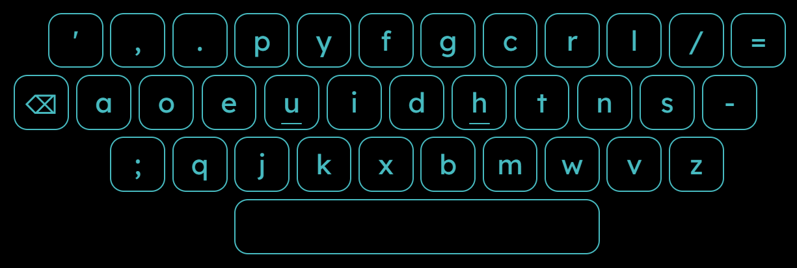

<!-- README inspired by @UnrealApex's -->

<samp>loading... ▓▓░░░░░░░░░░ (68/404)
   
   
  hi, i'm arivappa
   
  ⌨ i code stuff, passionate for automation
   
  🛸 playing: typeracer, monkeytype, nfs, coc
   
  🧰 tools: neovim, brave
   
  📡 [@4rivappa](https://github.com/4rivappa) and i go by `arivappa` on the internets
   
  🔭 curious about journey with ai
   
  ⚡ fun fact: i like typing _
   
  ✉️ thankful for everything i have, thank you [teej](https://github.com/tjdevries) for [video](https://www.youtube.com/watch?v=ZBduBppB8r0)
   
  💬 contact me: discord\[arivappa#5086\]
   
   
</samp>

<samp><b>keyboard layout</b></samp>

   
  

    
    &nbsp;&nbsp;&nbsp;&nbsp;
    
  

  
   
  <samp>
    wanna <a href="https://cal.com/arivappa">hangout</a>
  </samp>

